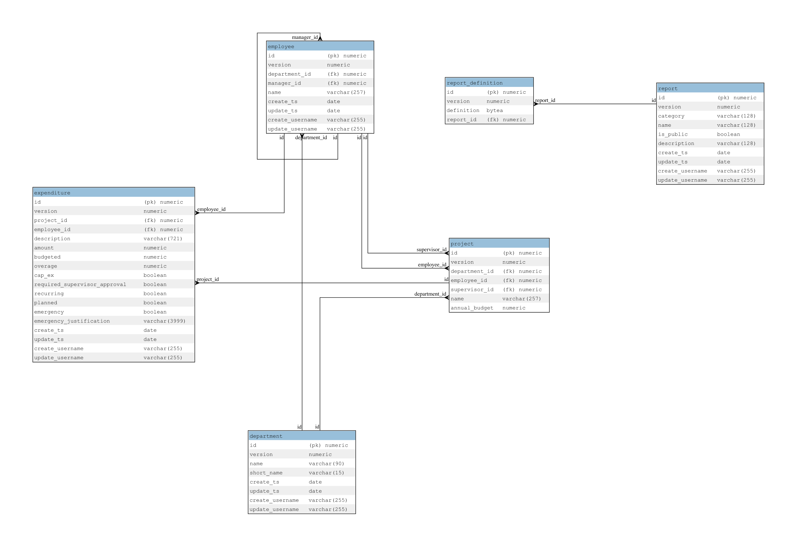

# JPA-to-ERD-reporting-plugin
This is a general plugin for creating a Vendor agnostic (Logical) ERD from JPA entities by reading the annotations.  
The resulting diagram should be logically correct even if not applicable to a given DB Vendor.  

Here is sample report screen shot:


## how to enable it (Assuming you compiled the project and installed it into maven local)
include this fragment as your reporting section:
```xml

	<reporting>
		<plugins>
			<plugin>
				<groupId>net.youngdev.maven.plugins</groupId>
				<artifactId>JPA-to-ERD-reporting-plugin</artifactId>
				<version>0.0.9-SNAPSHOT</version>
				<configuration>
					<entityPackage>my.entity.package.name</entityPackage>
				</configuration>
			</plugin>

		</plugins>
	</reporting>
```

## General features
- Supports Relationship detection with directed edges between nodes (crow's foot)
- based on graphviz so the dot layout script is easily pulled from the report
- all non-transient, non-static, JPA annotated fields including (Id, Column, JoinColumn)
- datatype detection
- Primary and Foriegn key detection

## Coming soon
- new license (I'm leaning toward BSD but I need to check all the dependencies first)
- Clean up the actual report layout 
- refactor the code.  The code is fugly and I don't wan't future employers to look at it
- Code coverage
- Build a sample reference project
- document config
- Submit my handy plugin to maven central

## troubleshooting
I've noticed a few peculiarities that require your project to be written with certain conventions in order for the graph to work;
- Every column should have either a Column annotation or JoinColumn annoation.  We use this to the get the database name
- the jar containing javax.persistence.* annotation classes must be in compile scope